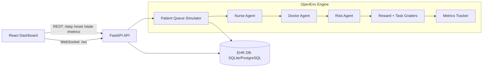

# AI Patient Triage & Routing System (OpenEnv + Multi-Agent + Real-Time Dashboard)

Production-grade, end-to-end hospital triage simulation with:
- FastAPI backend + OpenEnv environment
- Multi-agent workflow (nurse -> doctor -> risk)
- EHR-backed decision context (SQLite/PostgreSQL)
- Real-time WebSocket streaming
- React + Tailwind premium dashboard
- Dockerized local and Hugging Face Spaces deployment paths

## 1. Architecture



## 2. Project Structure

```text
backend/
  app/
    __init__.py
    agents.py
    database.py
    env.py
    main.py
    models.py
    routes.py
    workflow.py
  baseline_agent.py
  Dockerfile
  main.py
  requirements.txt

frontend/
  src/
    components/
      DecisionLogs.jsx
      LivePatientViewer.jsx
      MetricsCharts.jsx
      QueueList.jsx
      Sidebar.jsx
      StatCard.jsx
    pages/
      DashboardPage.jsx
    services/
      api.js
      socket.js
    App.jsx
    index.css
    main.jsx
  Dockerfile
  nginx.conf
  index.html
  package.json
  postcss.config.js
  tailwind.config.js
  vite.config.js

Dockerfile
requirements.txt
docker-compose.yml
README.md
```

## 3. OpenEnv Design

`OpenEnvTriage` in `backend/app/env.py` exposes:
- `reset()`
- `step(action)`
- `state()`
- `metrics()`

Behavior:
- Dynamically generates patients with symptoms, vitals, age, history, allergies
- Maintains prioritized queue using emergency-aware urgency scoring
- Runs LangGraph-style sequential pipeline:
  - Nurse Agent (initial triage)
  - Doctor Agent (diagnosis + department routing)
  - Risk Agent (safety override)
- Computes reward:
  - Partial credit for safe/accurate triage
  - Penalty for wrong department
  - Penalty for delay and critical misses
- Grades tasks per difficulty level:
  - Easy: basic symptom triage
  - Medium: multi-symptom routing
  - Hard: emergency prioritization

## 4. API Endpoints

Base URL: `http://localhost:8000`

- `POST /step`
  - Optional body action:
  ```json
  {
    "action": {
      "triage_level": "high",
      "department": "cardiology",
      "priority": 82
    }
  }
  ```
  - If no action supplied, internal multi-agent workflow decides.

- `POST /reset`
  - Reset environment and queue.

- `GET /state`
  - Current queue, active patient, last action/reward, decision trace.

- `GET /metrics`
  - Reward, accuracy, queue load, response time + history arrays.

- `GET /health`
  - Service health check.

- `WS /ws`
  - Streams events:
    - `bootstrap`
    - `reset`
    - `step`

## 5. Metrics

Tracked continuously in environment:
- `reward`: mean reward over steps
- `accuracy`: strict triage+department correctness ratio
- `queue_load`: current waiting patients
- `response_time`: average step processing latency
- history arrays used by charts in dashboard

## 6. Run Locally in VS Code

### Quick Start (Recommended)

From project root (`c:/Users/HP/hackothons`):

```bash
python run_joined.py
```

Then open:
- `http://localhost:8000`

This is the easiest mode because frontend + backend are served together on one port.

### Joined Mode (One App, One Port)

Build frontend, embed into backend, and run both from FastAPI:

```bash
python run_joined.py
```

Open:
- `http://localhost:8000` (dashboard)
- API and WebSocket are on the same host/port.

What `run_joined.py` does automatically:
- Installs frontend dependencies
- Builds the React frontend
- Copies frontend build into `backend/static`
- Starts FastAPI (`uvicorn`) on port `8000`

### Backend

```bash
cd backend
python -m venv .venv
# Windows PowerShell
.\.venv\Scripts\Activate.ps1
pip install -r requirements.txt
python main.py
```

Backend runs on `http://localhost:8000`.

### Frontend

```bash
cd frontend
npm.cmd install
npm.cmd run dev
```

Frontend runs on `http://localhost:5173` and proxies API/WS to backend.

## 7. Troubleshooting

### "It is not connecting"

1. Verify backend is running:
```bash
http://localhost:8000/health
```
Expected response: `{"status":"ok"}`

2. If using joined mode, open only:
```bash
http://localhost:8000
```

3. If port `8000` is busy (Windows), free it:
```powershell
Get-NetTCPConnection -LocalPort 8000 -State Listen | Select-Object OwningProcess
Stop-Process -Id <PID> -Force
```

4. Restart joined mode:
```bash
python run_joined.py
```

### PowerShell blocks `npm` script execution

Use `npm.cmd` instead of `npm`:

```bash
npm.cmd install
npm.cmd run dev
```

## 8. Docker Deployment

From project root:

```bash
docker-compose up --build
```

Services:
- Frontend: `http://localhost:3000`
- Backend API: `http://localhost:8000`

## 9. Hugging Face Spaces (Docker) Deployment

A single-container `Dockerfile` is included at root.
It builds frontend, embeds static assets into FastAPI, and serves on port `7860`.

Steps:
1. Create a **Docker Space**.
2. Push this repository.
3. Set optional secrets:
   - `OPENAI_API_KEY`
   - `OPENAI_MODEL`
   - `DATABASE_URL` (optional, defaults to SQLite)
4. Space launches with:
   - UI at `/`
   - API at `/state`, `/step`, `/metrics`, etc.

## 10. Baseline Agent Script (OpenAI + Reproducible Scoring)

```bash
cd backend
python baseline_agent.py
```

Notes:
- Uses fixed environment seed for reproducible score trends.
- If `OPENAI_API_KEY` is unavailable or request fails, script falls back to deterministic heuristic actions.

## 11. Environment Variables

Backend supports:
- `DATABASE_URL` (SQLite or PostgreSQL SQLAlchemy URL)
- `OPENAI_API_KEY`
- `OPENAI_MODEL` (default `gpt-4.1-mini`)

## 12. Production Notes

- CORS is enabled for integration flexibility.
- Queue is emergency-prioritized and continuously replenished.
- EHR history/allergies are integrated into doctor/risk decisions.
- WebSocket pushes state, decisions, and metrics in real time.
- Frontend is responsive and optimized for real-time monitoring.
## Author : Vinutha S
